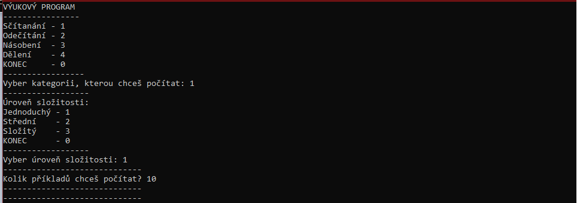

# vyukovy_program

Program bude na procvičování jednoduché matiky (+ - * /) a má různé složitosti (dohromady bude 3 úrovní složitosti).
Program bude generovat příklady a uživatel bude psát odpovědí. Uživatel bude mít 3 možnosti na zadání správné odpovědí, a pak po zadání 3 nesprávně program vypíše správnou odpověď.
Ze strány uživatele:
1) zadá úroveň složitosti
2) počet příkladů, které chce počítat
3) a pak jen řešit příklady

Program vygeneruje příklady, zkontroluje řešení a pak vypíše na konci počet bodů celkově za správně řešené úlohy a počet správně a špatně řešených úloh.


## Cíl

Cílem tohoto programu je procvičení sčítání/odečítání/násobení/dělení různě velkých čísel.


## Použití

Program se spouští spuštěním [vyukovy_program.py](vyukovy_program.py). Po spouštění tohoto programu se objeví okno s menu.

Uživatel vybere nějakou kategorii y menu. Pak se objeví další menu s úrovní složitostí.

Uživatel vybere úroveň složitostí, pak napíše počet příkladů, které chce počítat.

Takto vypadá celé menu s předvyplněnými položkami.

Pak začíná náhodné generování příkladú podle kategorii a úrovní složitostí.

Po ukončení počítání program vyíiše prospěšnost: počet správně řešených příkladů y celkového počtů, počet získaných bodů a procentní úspěšnost.


### Bodování

Každý příklad je za 3 body. Uživatel na 3 pokusy na řešení příkladu, každý další pokus -1 bod. Např. 
Za 3 body

Za 2 body

Za 1 bod

Za 0 bodů


### Kategorii

Pro káždou kategorii je funkce na generování prikladů. Jedná funkce na 3 úrovní složitosti, která má v parametru hodnoty pro rozsah generování.

#### Sčítání "+"
Hodoty pro generování sčítání. Odečítání, násobení a dělení je podobné (viz. kód [generator.py](generator.py).)
```python
...
def Sum():
    operace = "
    if level == 1:
        u = 0
        v = 20
        w = 1
    elif level == 2:
        u = 20
        v = 100
        w = 1
    elif level == 3:
        u = 100
        v = 1000
        w = 1
    generator.Pocet(Priklady, u, v, w, operace)
...
```

Funkce pro generování:
```python
...
def genSum(vysledek, x, u, v):
    a = randint(u,v)
    b = randint(0, v-a)
    x = a + b
    excercise = (f'{a} + {b} = ')
    vysledek = int(input(excercise))        
    return vysledek, x     
...
```

#### Odečítání "-"
Pro odečítání kód je stejný, odlišnost jen a - b.

```python
...
def genDif(vysledek, x, u, v):
    a = randint(u,v)
    b = randint(0, a)
    x = a - b
    excercise = (f'{a} - {b} = ')
    vysledek = int(input(excercise))        
    return vysledek, x     
...
```

#### Násobení "*"
```python
...
def genPro(vysledek, x, u, v, w):
    if randint(0,1) == 0:
        a = randrange(u, v, w)
        b = randint(0,9)
    else:
        a = randint(0,9)
        b = randrange(u, v, w)
    x = a * b
    excercise = (f'{a} * {b} = ')
    vysledek = int(input(excercise))
    return vysledek, x
...
```

#### Dělení "/"

```python
...
def genDiv(vysledek, x, u, v, w):
    a = randrange(u, v, w)
    b = randint(1,9)
    k = a * b
        
    if randint(0,1) == 0:
        x = a
        excercise = (f'{k} / {b} = ')
    else:
        x = b
        excercise = (f'{k} / {a} = ')
    vysledek = int(input(excercise))
    return vysledek, x
...
```
